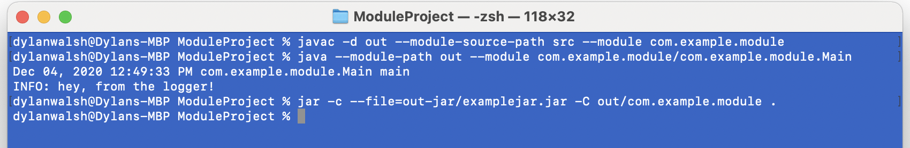
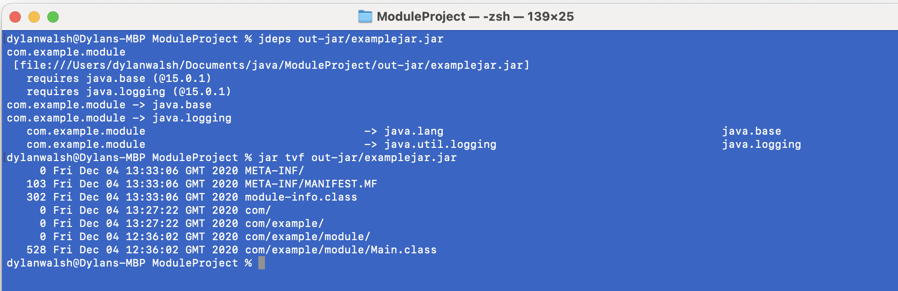
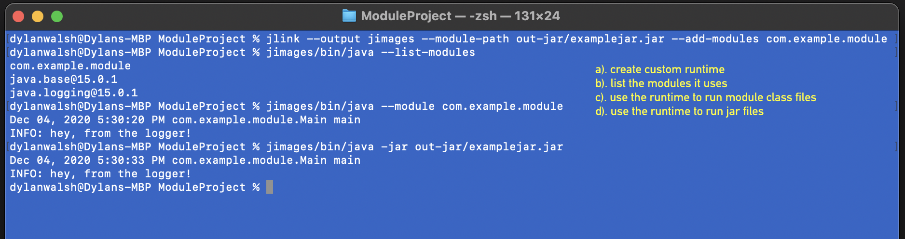
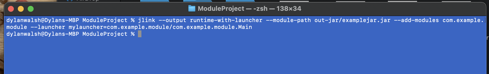
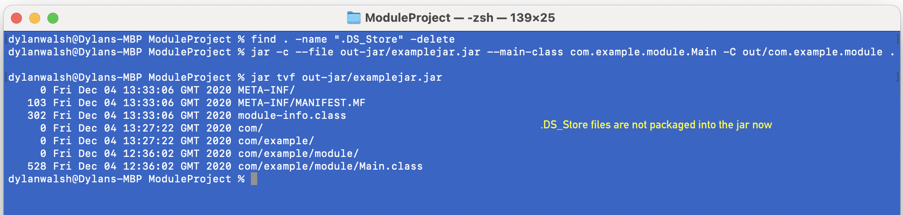
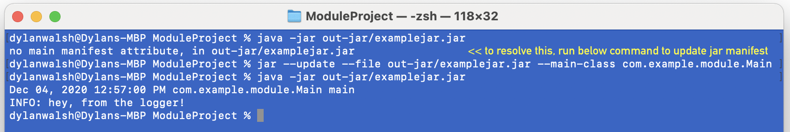
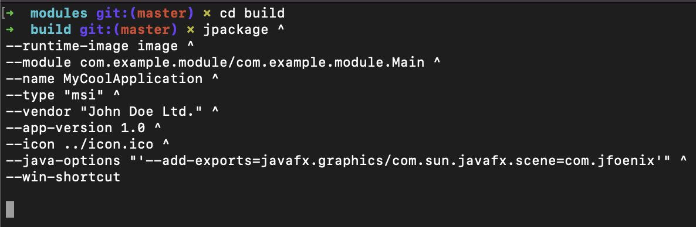

## Reference / cheat sheet on Java 9 modules and associated tools

### Compile, run and jar 🐌

### Jdeps and jar tvf 🐔

### Custom runtime image with jlink 🦖

### Custom runtime image with jlink (including a launcher) 🐸

### Remove DS_STORE files and re-create jar 🦧

### Update manifest and run jar 🦍

### Create runtime package and installer with jpackage using custom image 🦥

The following command creates a custom windows `MSI` installer (note this should be run on a Windows machine). The options used include:
- `--runtime-image` - Use the image generated by `jlink` inside the image folder
- `--module` - The main module of the application
- `--name` - The name of the application
- `--type` - Platform dependent type to use
- `--vendor` - The application vendor
- `--app-version` - Application / package version
- `--icon` - Use the given icon file for the package
- `--java-options` - Options to pass directly to the runtime (for example, exporting the `com.sun.javafx.scene` package of the `javafx.graphics` module to the unnamed module. Now `com.jfeonix` can read from the source package)
- `--win-shortcut` - Create a windows shortcut

